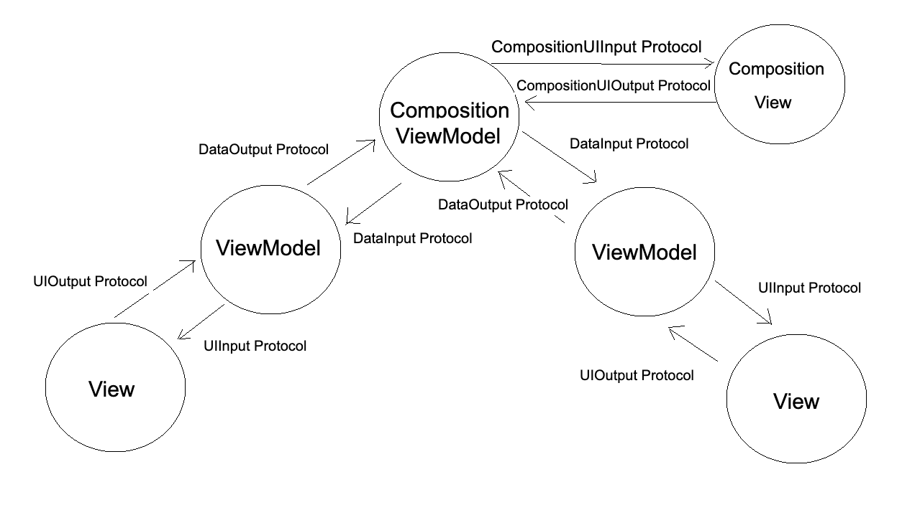
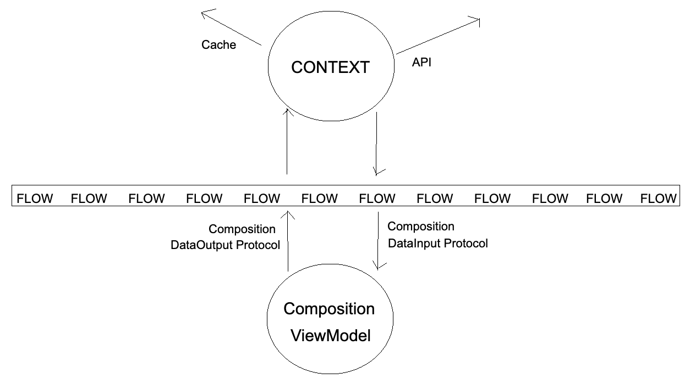

# VideoChatRoom

This is an example of how Video chat can be implemented from an Architecture perspective.

The goals:
 - Separate responsibilities
 - Make View Controller dumb (use only as a container)
 - Make subview dumb: Collect data from user inputs, send collected data to its ViewModel, display updated data to user.
 - Present ViewModel as a mediator between UI and Data.
 - Build CompositionView as a container for all subviews. Responsibilities: Build and Update elements layout, close, start and refresh room.
 - Use protocols oriented programming to describe views, models and compositions.
 - Set communication between layers like shown on image below. Using Observable protocol and protocols for all inputs and outputs
 - Use DI for insertion of ViewModels. For layers testing.

 - Set Flow as a mediator between Context and CompositionViewModel

